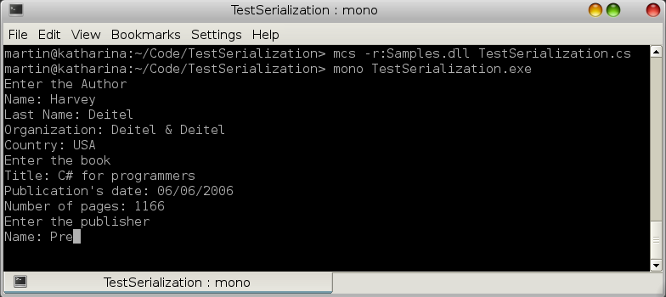
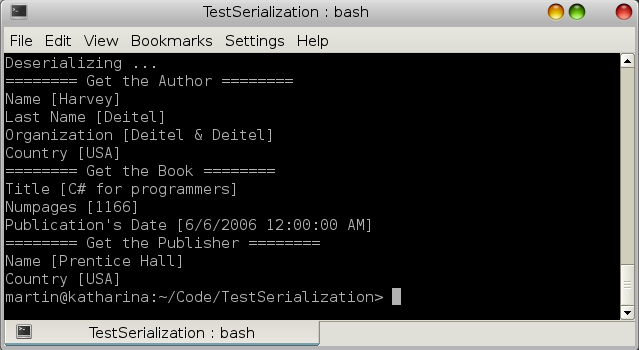

# Serialización de Objetos en .NET

Serialización se denomina al proceso de transferir un objeto que se ejecuta en la memoria de un programa hacia un medio de persistencia para conservar su estado y sus datos en ese momento, para  deserializarlo o bien volver a recuperarlo cuando se considere conveniente, en algunos casos el  mecanismo de serialización/deserialización es más práctico que utilizar las clases readers/writers para persistir.

En .NET existen tres tipos de serialización: Binaria, XML y Soap los cuales nos permiten cierta independencia del medio de transporte. La serialización binaria es la más sencilla, óptima y ofrece un mejor rendimeinto que los otros tipos de serialización, aunque no es recomendada si los objetos serializados requieren ser transportados hacia otros sistemas operativos, lenguajes de programación o arquitecturas que no sean .NET, por lo que para el tema de interoperabilidad las mejores opciones son la serialización de objetos en XML ó SOAP.

La serialización en .NET consiste básicamente en dos responsabilidades: una es la responsabilidad del objeto serializable el cuál indica los miembros a serializar y la otra es la del serializador/deserializador la cuál se encarga de transferir el objeto hacia o desde un medio de persistencia.
Supongamos una aplicación encargada de administrar una colección de libros, esta aplicación tiene una clase Author la cuál queremos serializar, primeramente marcamos la clase con el atributo:
<pre>
[Serializable]
</pre>
Hay que tener presente que no todas variable de instancia puede ser serializables, por ejemplo los metodos o variables estáticas no lo son, al contrario de los tipos primitivos, los arreglos y los objetos string los cuales son serializables de forma predeterminada. Siempre hay que asegurarse que los objetos y su clase base sean serializables antes de asumir que cualquier tipo de objeto puede ser serializado.
Si encontramos o necesitamos que una propiedad del objeto no sea serializable la marcamos con el atributo:
<pre>
[NonSerialized]
</pre>
A continuación mostramos el código fuente de una aplicación que muestra la serialización y deserialización binaria de una relación de objetos mediante la utilización de la clase <a href="http://msdn.microsoft.com/en-us/library/system.runtime.serialization.formatters.binary.binaryformatter.aspx">BinaryFormatter</a>.
Los archivos que componen la aplicación son: <t>Author</t>, <t>Book</t> , <t>Publisher</t> y la clase principal <t>TestSerialization</t> la cuál implementa todo el código de forma concreta.

Este ejemplo básicamente crea un grafo de una relación de clases y lo serializa (lo pasa de la memoria hacia un medio de almacenamiento) en un archivo binario e inmediatamente lo deserializa, (del medio de almacenamiento lo trae a la memoria).En todo este proceso (excepto en donde se indique que no) se convierte el objeto <t>Book</t>,sus clases relacionadas y sus miembros en un flujo de bytes  hacia el disco duro para posteriormente recuperarlo con el mismo proceso en orden inverso. Todo esto se logra en esencia con las siguientes líneas.Para serializar y deserializar respectivamente:

<pre>
using(stream = new FileStream("Book.bin",FileMode.OpenOrCreate,FileAccess.Write)){
   binaryformatter.Serialize(stream,b);
 }
</pre>
<pre>
using(stream = new FileStream("Book.bin",FileMode.Open,FileAccess.Read))
{
   b = (Book)binaryformatter.Deserialize(stream);
}
</pre>

Al compilar y ejecutar el programa, mediante los siguientes comandos:

<pre>
$ mcs /t:library Author.cs Book.cs Publisher.cs /out:Samples.dll</tt>
$ mcs -r:Samples.dll TestSerialization.cs
$ mono TestSerialization.cs</pre>

 

 

Mostramos la serialización y deserialización de un grafo de objetos relacionados.
 

